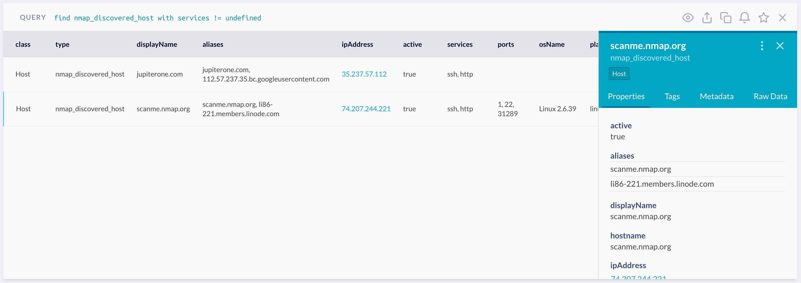

# graph-nmap

This is a local/unmanaged integration that scans vulnerability reports from
[Vuls.io](https://vuls.io) scans and ingests the findings into JupiterOne (J1).

## Getting Started

These instructions will get you a copy of the project up and running on your
local machine for development and testing purposes. See deployment for notes on
how to deploy the project on a live system.

### Prerequisites

* Node.js
* J1 Account
* J1 API Key
* Nmap installed locally

### Usage

Export the following environment variables (or store locally in a `.env` file):

```bash
export J1_ACCESS_TOKEN=<api_key>
export J1_ACCOUNT=<account_id>
```

`J1_ACCOUNT` should be your JupiterOne `accountId`, which can be found by
running the query `Find Account as a return a.accountId` in the JupiterOne web
console.

`J1_ACCESS_TOKEN` is a JupiterOne API key, which can be created in the
JupiterOne console by going to the gear icon in the top-right, then clicking
`Users & Access`, then click the key icon and create an API key.

Then run:

1. `yarn install`

1. `nmap` scan and output to an XML file. For example:

   ```bash
   nmap -v -sn 192.168.1.0/24 -oX local/nmap-out.xml
   ```

1. `cat local/{filename}.xml | yarn ts-node ./src/index.ts`

1. The newly created entities are of class `Host` and can be found through the
   J1QL query `Find nmap_discovered_host`.

   Example output on JupiterOne:

   

### Examples

An example Nmap output file is included in `test/nmap-out.xml`. The converted
`test/nmap-out.json` file is for reference purpose only.
